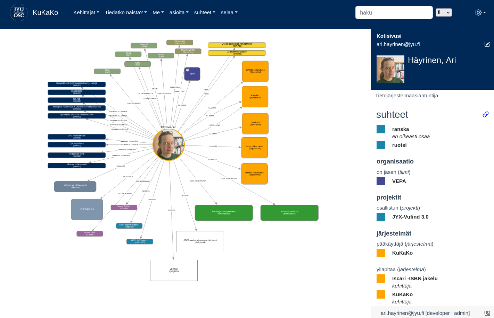

# KuKaKo

KuKaKo is a visual, open source tool for
communicating (sometimes messy) connections between people and things in community.

- KuKaKo is cute, simple and very human centric!
- Very flexible, visual schema  
- Visual graph view can be re-arranged by user per query or node view
- Navigation is based on powerful queries and is adjustable per user group
- Nodes and relationships can be deactivated (archived) instead of removing

For developers (experimental)
- Automatic repository graph of repositories based on commits
- Automatic virtualisation graph from Docker (containers, images and volumes)

## Quick Start (local mode)

This will install KuKaKo in local mode with admin rights, so that you can test things.
You should have Git and Docker Compose installed.

	git clone https://github.com/OSC-JYU/KuKaKo.git
	cd KuKaKo
	docker-compose up

Now you should have KuKaKo running on http://localhost:8100

BETTER DOCS COMING SOON!

There is not much to see in fresh install. Just one node saying that's "Local You".
If you click the blue pencil icon, you can see more pencil icons and from there you can edit description and label.

## User Interface

### Queries
Queries use powerful Cypher query language and they are the main tool for showing graph data nicely to users. Queries are linked to Menu nodes.
Queries are nodes with type Query.

### Menus
Menus are query holders in the user interface. Menus are linked to UserGroups and are visible only Persons within that UserGrop.
Menus are nodes with type "Menu".

## User groups and roles
Persons are also users of KuKaKo.

### User Groups
User groups define what user can see in the system. Each user group can have their own menus and queries on them.
User groups are nodes with type UserGroup.

### User Roles
User roles define what user can do in the system and user can have only one role. There are three user roles in KuKaKo.

1. **user**
"User" can edit only relationships from and to "me".
2.**creator**
"Creator" can add nodes, edit nodes and add and edit all relationships.
3. **admin**
admin can set user roles for other users and user can edit schema.

### Schema

The reason that you can't do more is that there is no schema. Schema is guide for humans of what kind of data you can produce with KuKako.

You can check current schema from "admin" -> "Schema"

As you can see, there is only Person available.

Let's load schema, so we can add things to our graph.

Choose "admin" -> "import schema" -> "organisation_en.yaml" and click "DELETE ALL and import".

Now check the schema page again (reload if necessary).You should see structure for organisation. There are teams, work groups, IT systems, web sites etc.

### Editing

Click main header ("KuKaKo") and click pencil icon. Now you should see all the things that you can be linked to.

Try to create a Team for you. Click line "member of (Team)" and click + icon. Now you can create a Team and you are automatically linked to it.

NOTE: This works because you have admin rights in development node. 

### Styles

You'll soon notice that your graph looks boring. Import some style from "admin" -> "import style" -> "organisation.json" -> "DELETE ALL and import". Reload page and you should have much nicer looking graph!

### Import more data

Try what happend if you import 1000 persons! Go "admin" -> "import graph" -> "persons_1000.yaml" -> "DELETE ALL and import".

Reload and you should see some new menu items in your scene.

## User authentication and creation

A new Person node is created when user enters to KuKaKo first time. Currently this is not configurable (BUT IT WILL BE)

KuKaKo relies request headers for authentication. This means that every request to KuKaKo backend must be already authenticated by Shibboleth, for example. By default KuKaKo uses header called 'mail'. This can be changed by editing const 'AUTH_HEADER' in index.js.   

	const AUTH_HEADER = 'mail'  // change if needed

Also note that the same header is used for 'id' of Person nodes.

### Development

If you have NodeJS installed, you can run KuKaKo directly on NodeJS (for development).

First start Arcadedb:

	docker run --rm -p 2480:2480 -p 2424:2424 -v kukako_arcade:/home/arcadedb/databases  -e JAVA_OPTS="-Darcadedb.server.rootPassword=node_master" arcadedata/arcadedb:23.5.1

Then clone KuKako repository and start it:

	git clone https://github.com/OSC-JYU/KuKaKo.git
	cd kukako
	npm install
	MODE=development DB_PASSWORD=node_master node index.js

# FAQ

Q: How to run KuKaKo in non root URL (like "domain.org/sub/kukako")?

A: You must set path in three files in UI code.
/src/web.js:  axios.defaults.baseURL = '/s/kukako'
/src/main.js: let history = '/s/kukako'
vite.config.js: base: '/s/kukako/'
