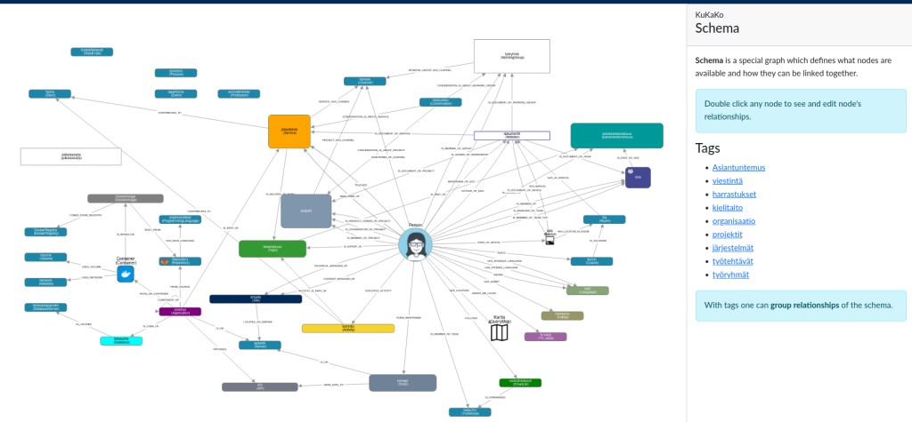
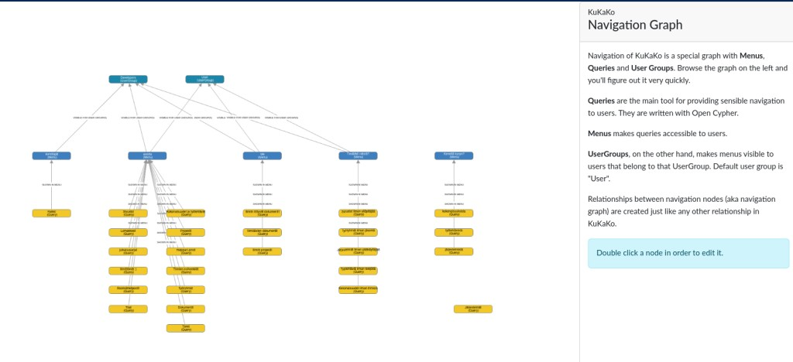

Admin
======

Admins can alter the change navigation settings, set user privileges and alter schema.

Setting things up
------------------

The first thing you must do as an admin, is to load schema.

    Choose gear icon -> "import schema" -> "organisation_en.yaml" and click "DELETE ALL and import".

Now check the schema page again (reload if necessary).You should see structure for organisation. There are teams, work groups, IT systems, web sites etc.

Setting up navigation
^^^^^^^^^^^^^^^^^^^^^

KuKaKo is graph based system and also navigation is graph. You can find it from "navigation" under the gear menu.

Navigation graph consists of queries, menus and user groups.

UserGroups, on the other hand, makes menus visible to users that belong to that UserGroup. Default user group is "User".

**Queries** use powerful Cypher query language and they are the main tool for showing graph data nicely to users. Queries are nodes with type Query and theyr are linked to Menu nodes.

**Menus** are query holders in the user interface. Menus are linked to UserGroups and are visible only Persons within that UserGrop. Menus are nodes with type "Menu".

User groups and roles
^^^^^^^^^^^^^^^^^^^^^

Persons are also users of KuKaKo.

User groups define what user can see in the system. Each user group can have their own menus and queries on them. User groups are nodes with type UserGroup.

User Roles
----------

User roles define what user can do in the system and user can have only one role. There are three user roles in KuKaKo.

* User
    can edit only relationships from and to "me". 
* Creator 
    aka "content manager", can add nodes, edit nodes and add and edit all edges between nodes.
* Admin 
    admin can set user roles for other users and admin can edit schema.

