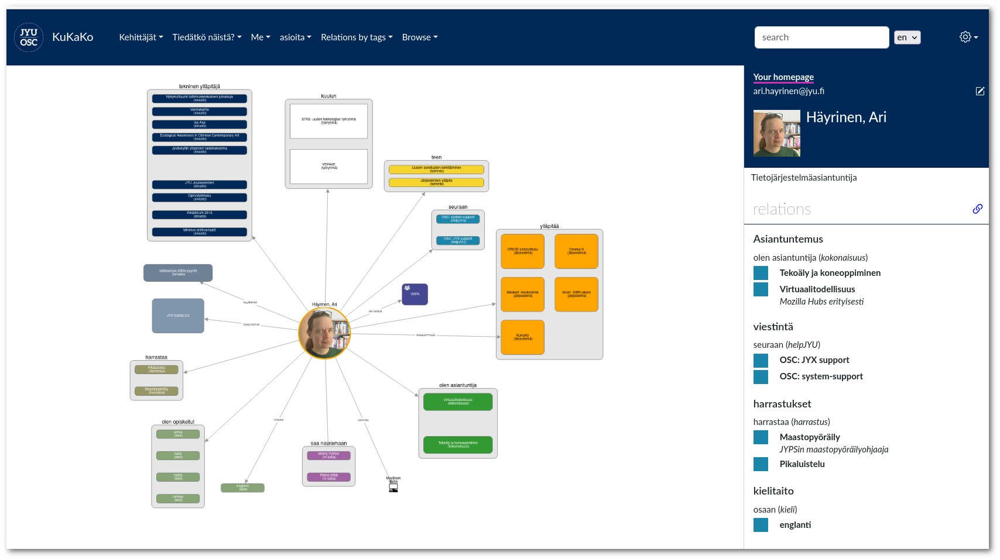

Introduction
========================================

.. centered:: KuKaKo: Make your organisation browseable!

KuKaKo is a visual, open source tool for communicating (sometimes messy) connections between people and things in community.

* KuKaKo is cute, simple and very human centric!
* Very flexible, visual schema
* Visual graph can be re-arranged by user per query or node view
* Navigation is based on powerful queries and is adjustable per user group
* Nodes and relationships can be deactivated (archived) instead of removing
* Process documentation by Stories (experimental)

KuKaKo uses **directed graph** for storing and displaying data. A directed graph is like a visual network of points connected by arrows. The points are called nodes, while the arrows are edges. Nodes have type like "Website" or "Person" and edges have label like "IS AUTHOR OF" or "IS PART OF".

.. note::

    KuKaKo is NOT a diagram or flow chart software.

When nodes are linked with these edges, the result is a directed graph that is exceptionally well-suited for representing complex relationships. This approach allows KuKaKo to efficiently store, organize, and display various types of information, making it a versatile tool for visualizing connections between different entities, whether it's mapping the relationships between websites and authors, or illustrating how individuals are associated with various groups or organizations.

**Schema** defines what types of nodes are available and how they can be linked. Schema itself is a graph and you can find it by clicking the gear icon on the top-right corner and choosing "Schema".

.. image:: images/schema.jpg

.. note::

    Editing schema requires admin rights.

User Interface
^^^^^^^^^^^^^^^^^

Given that the visual graph in KuKaKo can become quite complex, especially when it encompasses thousands of nodes and edges, we've implemented a user-friendly approach to help users navigate and focus on specific subsets of the data. Users will find their personalized homepages and menus, which serve as entry points, displaying manageable subgraphs. 

These subgraphs offer a condensed view, allowing users to dive deeper into the graph by simply double-clicking on nodes within the visual representation. This intuitive system empowers users to explore and interact with the data at their preferred granularity, ensuring a more streamlined and efficient experience.

Navigation
----------

Every user has **home page**, where only nodes directly linked to the user are displayed. The visual graph can be arranged by the user just by dragging nodes.

The main user interface consists of menu, visul graph display and list view. 

List view
On the right side is the list view. It show the same data as graph view, but in the form of list.

User can navigate with 

Queries
--------

Queries use powerful Cypher query language and they are the main tool for showing graph data nicely to users. Queries are linked to Menu nodes. Queries are nodes with type Query.
Menus

Menus are query holders in the user interface. Menus are linked to UserGroups and are visible only Persons within that UserGrop. Menus are nodes with type "Menu".
User groups and roles

Persons are also users of KuKaKo.

User groups define what user can see in the system. Each user group can have their own menus and queries on them. User groups are nodes with type UserGroup.

User Roles
----------

User roles define what user can do in the system and user can have only one role. There are three user roles in KuKaKo.

* User
    can edit only relationships from and to "me". 
* Creator 
    aka "content manager", can add nodes, edit nodes and add and edit all edges between nodes.
* Admin 
    admin can set user roles for other users and admin can edit schema.

