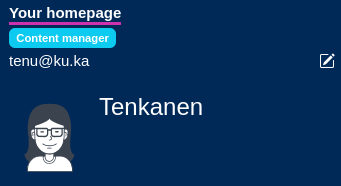
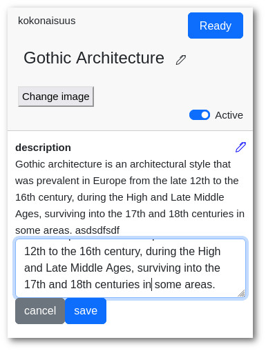
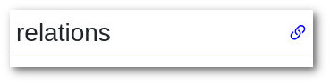
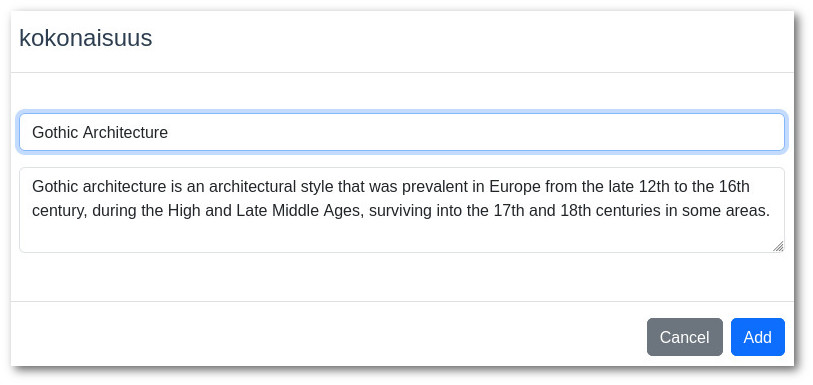

Content Manager (Creator)
==========================

Content managers can create new nodes, edit nodes and edit relations between nodes.

Editing textual info and renaming
^^^^^^^^^^^^^^^^^^^^^

As a content manager you can edit all textual info in any node (execpt shema). Just click the pen icon and change the text in any node.

.. note::

    **Think before renaming things that have connections!** 
	For example, if you rename language French to Italy, then all users that have linked themselves to French speakers are all suddenly Italian speakers. 

Editing relations
^^^^^^^^^^^^^^^^^

Editing relations between things works similarly than editing connections on your homepage. Only difference is that content manager can edit relations on every page. 

Just click the icon next to "relations" and adjust relations.

Adding new nodes
^^^^^^^^^^^^^^^^^^^^^^^^^^

Content manager can also add new nodes. 

Open the gear icon from the right top corner and select Add Node.

 Then click the type, type information required and click "Add".

