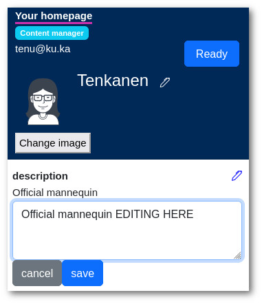
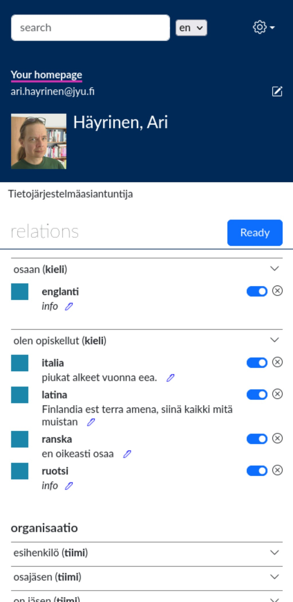
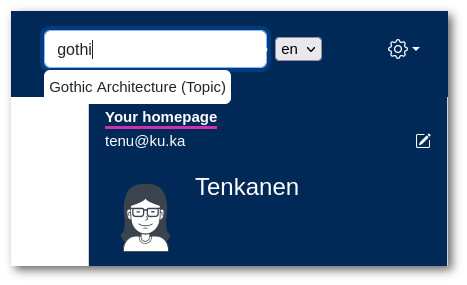
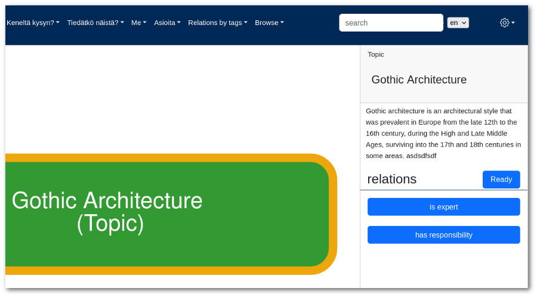

User Documentation
==================

When you enter to KuKaKo, you'll land on your homepage. This is the page where you can see your graph and connect yourself to things that are somehow related to your. Things like what tools you use, what activities you participate, hobbies, cats etc.

.. image:: images/homepage.png

Editing homepage
^^^^^^^^^^^^^^^^

There are two edit buttons on the right side. The upper (the pencil icon) is for text content like your name and description. The lower one is for links, that you can edit.

.. image:: images/homepage_edit_buttons.jpg
   :width: 300

Editing textual info
^^^^^^^^^^^^^^^^^^^^^^

Click the "pencil" icon on your homepage. That makes all text fields editable (more pencil icons). When you are ready, just click "save". Click "ready" in order to exit editing mode.

Changing you name works a little bit differently. There is no save button. Instead, just hit enter when you are done with changing your name.

Connecting yourself
^^^^^^^^^^^^^^^^^^^

By default you'll see only created connections (relations) in your homepage. If you want to edit connections, then find the "chain" icon next to "relations". 

.. figure:: images/creator_edit_rel.jpg

   The "chain" icon

When you click the icon you'll see all possible connections that you can make. 

Editing connections by search
^^^^^^^^^^^^^^^^^^^^^^^^^^^^^

Another way to establish connections is by connecting from a different perspective.

For instance, if you come across something interesting in a search, like an expertise labeled "Gothic Architecture," which happens to align with one of your own expertise areas, you can take advantage of this opportunity. 

1. Make a search

When you're on the homepage of "Gothic Architecture" and KuKaKo is configured to allow you to create links to expertise areas in its schema, you'll notice a button on the right-hand side. 

2. Clicking on this button enables you to establish a link to that specific node.

.. image:: images/homepage_relations_second_way_result.jpg

Easy!

